# Projekt M346

[](https://github.com/luccaa79)
[](https://github.com/nifrtestacc)
[](https://github.com/K-Y-77)

---

## 📜 Überblick

Diese Anleitung beschreibt Schritt für Schritt, wie eine **Nextcloud-Installation in der Amazon Web Services (AWS) Cloud** bereitgestellt wird.  
Neben dem Server für die Anwendung wird zusätzlich ein **separater Server für die Datenbank (MariaDB)** eingerichtet.

Alle erforderlichen Konfigurationsdateien und Skripte befinden sich in diesem Repository.  
Mithilfe der folgenden Schritte kann die gesamte Installation **vollständig reproduziert** werden.

---

## 📂 Inhaltsverzeichnis
 
1. [Voraussetzungen](#-voraussetzungen)
2. [Architekturübersicht](#-architekturübersicht)
3. [Netzwerk & Sicherheitsgruppen](#-netzwerk--sicherheitsgruppen)
4. [Installation](#-installation)
5. [Zugriff auf Datenbank](#zugriff-auf-datenbank)
6. [Zugriff auf Nextcloud](#zugriff-auf-nextcloud)
7. [Testfälle](#testfälle)
8. [Reflexion](#reflexion)
9. [Aufgabenverteilung](#aufgabenverteilung)

---

## ✅ Voraussetzungen

Bevor man startet, muss sichergestellt werden, dass folgende Voraussetzungen erfüllt sind:

- Ein AWS-Account mit administrativen Berechtigungen.
- Installierte und konfigurierte **AWS CLI**.
  👉 Anleitung: [GBSSG GitLab m346](https://gbssg.gitlab.io/m346/iac-aws-cli/)
- Installiertes **Git**.
- Ein Webbrowser für den Zugriff auf die Nextcloud-Weboberfläche.
- Ein SSH-Key, der in AWS hinterlegt ist.
- Git-Token erstellen für das klonen des Repositories (wird unten von der Installation beschrieben).

---

## 🏗 Architekturübersicht

Die Installation besteht aus zwei EC2-Instanzen:

- **Webserver**
  - Nextcloud / Apache
- **Datenbankserver**
  - MariaDB

Die Kommunikation zwischen Webserver und Datenbank erfolgt **ausschliesslich innerhalb des AWS-VPCs**.

---

## 🌐 Netzwerk & Sicherheitsgruppen

Bevor die beiden EC2-Instanzen installiert und konfiguriert werden können, ist es zwingend erforderlich, die eingehenden Datenverkehrregeln anzupassen. Nur so lassen sich der Webserver und der Datenbankserver korrekt einrichten.

Die Einstellungen werden unter `EC2 / Instances / [Instanz auswählen] / Sicherheit / Sicherheitsgruppen` angepasst.

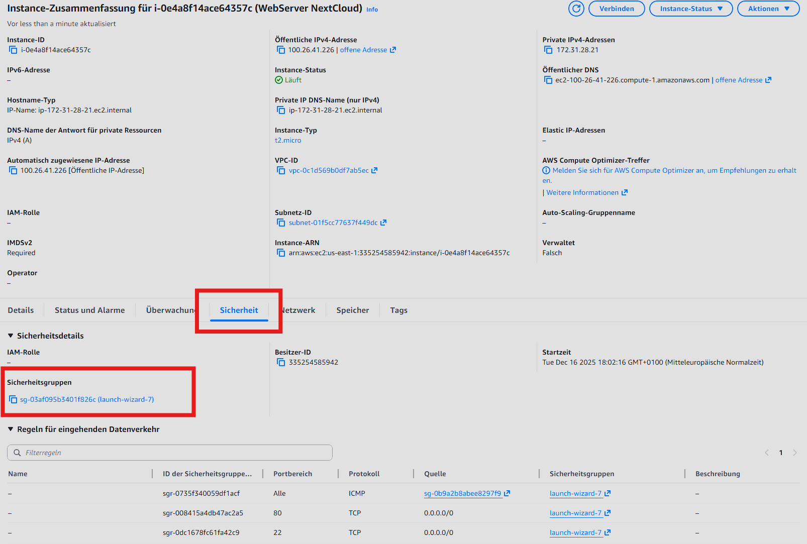
*Abbildung 1: Pfad zur Sicherheitsgruppe*

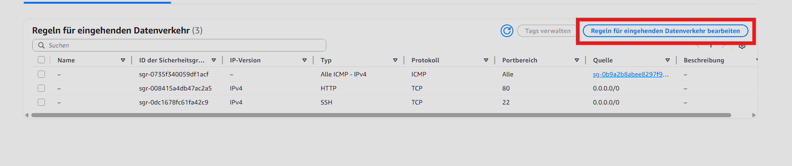 
*Abbildung 2: Ändern des eingehenden Datenverkehrs*

Folgende Regeln müssen bei dem **Datenbank Server** hinzugefügt werden:

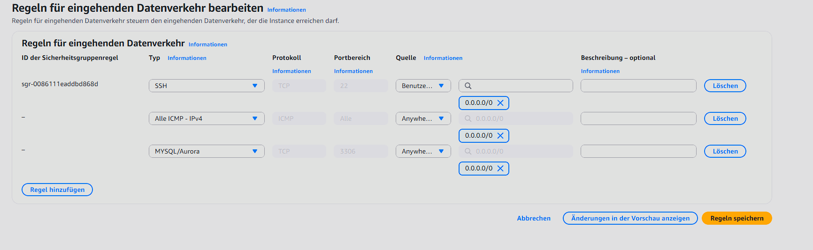 
*Abbildung 3: Datenbank Server Portkonfiguration*

Folgende Regeln müssen bei dem **Webserver** hinzugefügt werden.

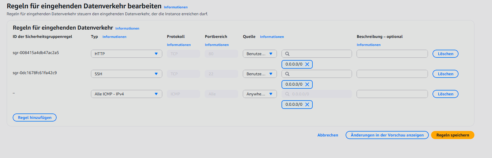 
*Abbildung 4: Webserver Portkonfiguration*

Sind diese Regeln nun hinzugefügt resp. angepasst, kann die Installation im nächsten Schritt problemlos vollbracht werden.

---

## 🚀 Installation

Bevor mit der effektiven Installation begonnen wird, muss in GitHub ein Access Token hinterlegt werden. Ist dieser Token nicht hinterlegt, ist das klonen des Repositories
mit `git clone` nicht möglich.

- Anmeldung auf GitHub und rechts oben auf das Profilbild klicken. --> `Settings`
- Danach links in der Leiste ganz runter scrollen zu `Developer Settings` und drauf klicken.
- Anschliessend erneut links in der Leiste zu `Personal access tokens` --> `Fine-grained tokens`.
- Rechts oben auf den Button `Generate new token`.
- Dann den Token mit den gewünschten angaben erstellen (z.B. Name, Repository auswählen, ...).
- Ganz unten bei den Permissions müssen die Permissions für den User erteilt werden.
  
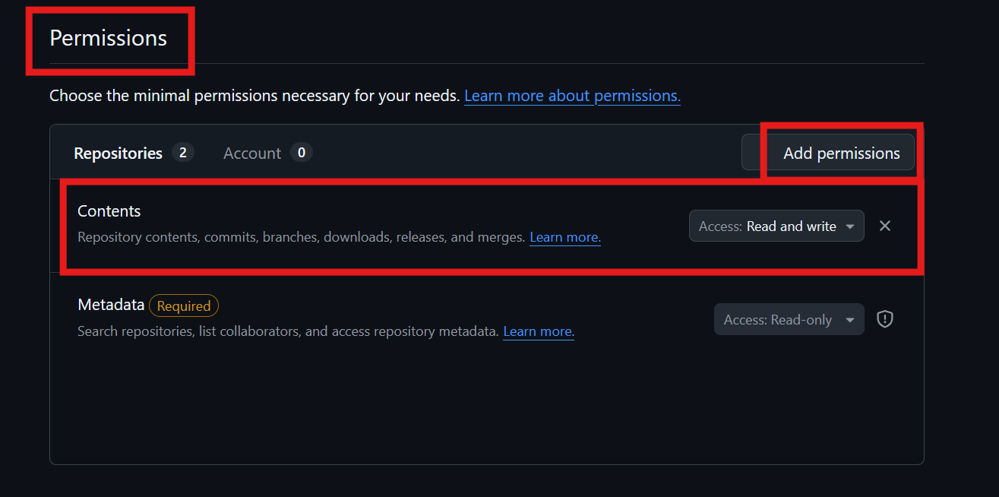 
*Abbildung 5: Permissions erteilen*


- Anschliessend `Generate Token`.
- Der Token, der hier angezeigt wird, sollte am besten in den lokalen Editor kopiert werden. **Nicht verlieren!!!**

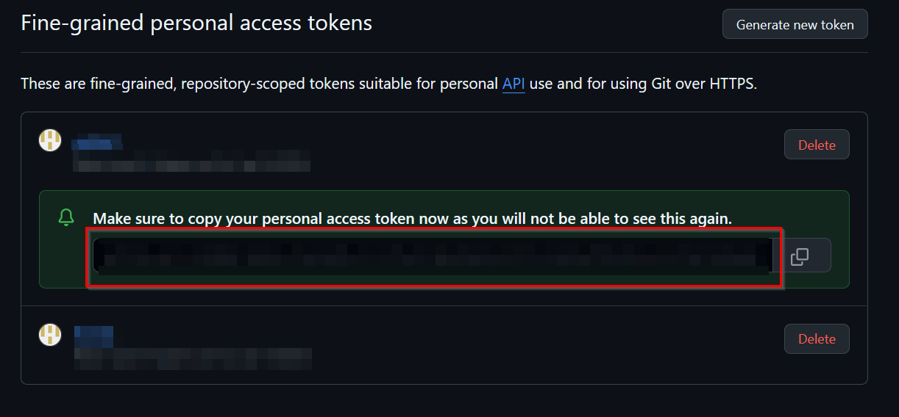 
*Abbildung 6: Token kopieren*


- Nachdem der `git clone` Befehl, später bei der Installation ausgeführt wird, wird eine Abfrage kommen. Zuerst muss der Username des Git-Benutzers angegeben werden. Anschliessend
  kommt eine Passwortabfrage. Bei dieser Passwortabfrage muss dann nicht das Passwort, sondern der Access Token eingegeben werden.

---

Repository klonen
```bash
git clone https://github.com/luccaa79/m346
```
 
ins Verzeichnis wechseln:
```bash
cd <pfad-zum-repository>
```

Ausführberechtigungen für das erste Skript anpassen:
```bash
chmod +x DBServer.sh
```

das erste Skript ausführen:
```bash
./DBServer.sh
```

> **Achtung:**  
> Bevor das zweite Skript `WebServer.sh` ausgeführt wird, muss die private IP-Adresse des Datenbank-Hosts in diesem Skript eingetragen werden. Dies erfolgt bei der Variable `DB_HOST` im oberen Bereich des Skripts.
```bash
DB_Host=private IP Adresse des Datenbank-Hosts
```

Ausführberechtigungen für das zweite Skript anpassen:
```bash
chmod +x WebServer.sh
```

das zweite Skript ausführen:
```bash
./WebServer.sh
```
---

## 🗄️ Zugriff auf Datenbank <a id="zugriff-auf-datenbank"></a>

Nach der erfolgreichen Ausführung vom Skript `DBServer.sh` ist **kein weiterer Konfigurationsschritt notwendig**.

Der Zugriff auf die Datenbank erfolgt direkt über die Konsole der EC2-Instanz:

```bash
mysql -u admin -p
```

Danach mit folgendem Passwort anmelden:

- **Passwort:** `xxx`

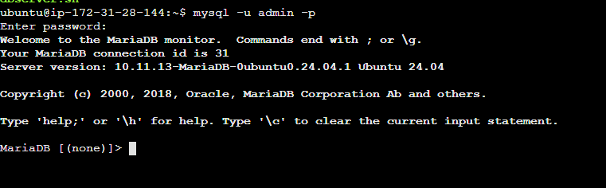
*Abbildung 7: Zugriff auf den Datenbankserver*

---

## ☁️ Zugriff auf Nextcloud <a id="zugriff-auf-nextcloud"></a>

Nach der erfolgreichen Installation ist der **Nextcloud Installationsassistent** über die Weboberfläche erreichbar. Der Zugriff erfolgt über die **öffentliche IP-Adresse** der EC2-Instanz mit dem Webserver installiert.

Beim ersten Aufruf wird der Installationsassistent (Abbildung 6) angezeigt. Die benötigten Datenbank-Zugangsdaten wurden am Ende des Skripts `WebServer.sh` in der Konsole aufgelistet.
  
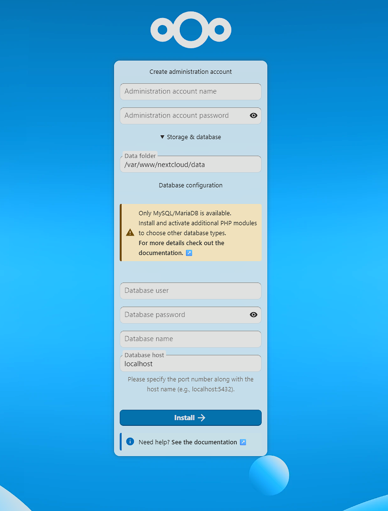  
*Abbildung 8: Zugriff auf die Nextcloud-Weboberfläche*

---

## 🛠️ Testfälle <a id="testfälle"></a>

**Test-ID:** 01

**Testzeitpunkt:** 14.12.2025 um 19:57

**Testperson:** Nico Frei

**Spezifische Informationen:** Nach dem Ausführen des Skripts `DBServer.sh` wurde die Kontrolle durchgeführt, ob sich der Benutzer `admin` mit dem passenden Kennwort an der Datenbank anmelden kann.

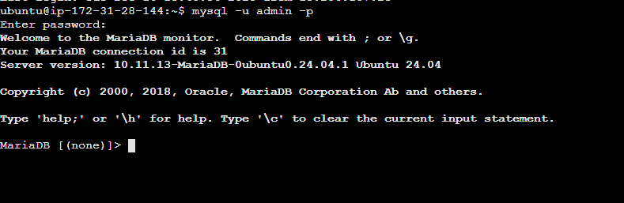  
*Abbildung 9: Anmeldung an Datenbank mit Administrator*

**Getroffene Massnahme:** Keine Massnahme erforderlich. Test erfolgreich.

**Fazit:** Der Datenbank Administrator `admin` kann sich einwandfrei an der Datenbank anmelden.

---
**Test-ID:** 02

**Testzeitpunkt:** 15.12.2025 um 21:27

**Testperson:** Nico Frei

**Spezifische Informationen:** Das Skript `WebServer.sh` wurde in der Konsole der Linux Instanz ausgeführt, auf welcher später der Webserver installiert werden sollte. Während der Installation ist jedoch diese Fehlermeldung aufgetaucht:

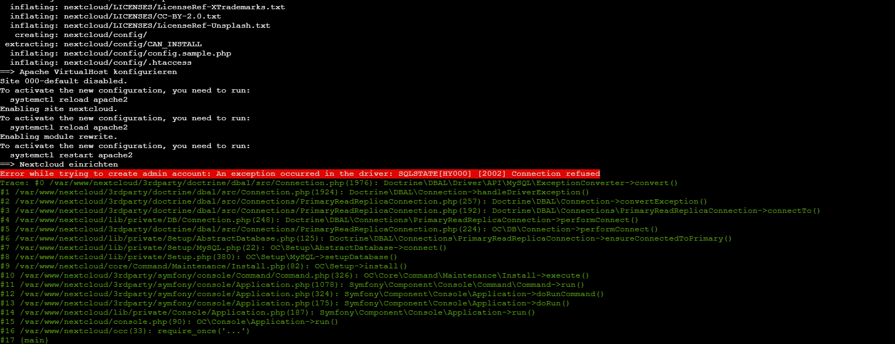  
*Abbildung 10: Fehlermeldung bei Skriptausführung*

**Getroffene Massnahme:** In der Datei `/etc/mysql/mariadb.conf.d/50-server.cnf` war die Bind-IP-Adresse auf `127.0.0.1` gesetzt. Dies ermöglichte keine externe Verbindungen. Nach dieser Kenntnis wurde die Bind-IP-Adresse auf `0.0.0.0` gesetzt.

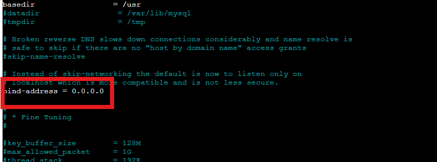  
*Abbildung 11: Anpassung Bind-IP-Adresse*

**Fazit:** Nach den getätigten Anpassungen konnten externe Verbindungen erstellt werden. Bei dem erneuten Ausführung des Skripts `WebServer.sh` konnte die Verbindung hergestellt werden.

---
**Test-ID:** 03

**Testzeitpunkt:** 15.12.2025 um 22:08

**Testperson:** Nico Frei

**Spezifische Informationen:** Bei diesem Test wurde der Status der Webservers abgerufen. Somit wurde sichergestellt, dass der NextCloud Installationsassisten über den Browser erreichbar ist.

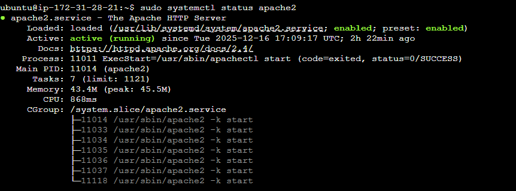  
*Abbildung 12: Statusabfrage Webserver*

**Getroffene Massnahme:** Keine weiteren Massnahmen erforderlich. Test erfolgreich.

**Fazit:** Der Webserver Status wird als `active (running)` ausgegeben. Dies bestätigt, dass der NextCloud Installationsassistent über die Website erreichbar ist.

---

## 🔍 Reflexion <a id="reflexion"></a>

### 💡 [Luca Vatrella](https://github.com/luccaa79 "Luca Vatrella's GitHub Profile")

Durch das Projekt habe ich gelernt, technische Arbeiten verständlicher zu dokumentieren. Besonders bei der Installation und Konfiguration war es wichtig, die einzelnen Schritte klar festzuhalten, damit sie auch von anderen nachvollzogen werden können.
Die Zusammenarbeit im Team hat gut funktioniert, vor allem dank der klaren Aufgabenverteilung.
Verbesserungsbedarf sehe ich darin, dass wir uns im Team früher und häufiger hätten abstimmen sollen, damit Änderungen zeitnah in die Dokumentation übernommen werden können.

### 💭 [Nico Frei](https://github.com/nifrtestacc "Nico Frei's GitHub Profile")
 
Ich war hauptsächlich für die Erstellung der Installationsskripte zuständig und konnte dabei mein Wissen in Scripting und Serverkonfiguration erweitern. Positiv war, dass die Skripte nach dem Testen zuverlässig funktionierten.

### ✨ [Kubilay Yildiz](https://github.com/K-Y-77 "Kubilay Yildiz's GitHub Profile")
 
Meine Aufgaben lagen vor allem im Testen der Skripte und in der Fehlersuche. Dadurch habe ich ein besseres Verständnis für die Serverumgebung und deren Zusammenspiel erhalten. Positiv war die schnelle Abstimmung im Team bei gefundenen Fehlern.
Verbesserungspotenzial sehe ich in einer strukturierteren Testplanung, zum Beispiel mit einer Checkliste.

---

## 👥 Aufgabenverteilung <a id="aufgabenverteilung"></a>

- **Nico Frei** ist verantwortlich für die Erstellung und Umsetzung der Installationsskripte (DBServer.sh und WebServer.sh). Diese automatisieren die Installation und Konfiguration der Serverumgebung auf AWS.

- **Luca Vatrella** übernimmt den Grossteil der Dokumentation des Projekts. Dazu gehört die Erstellung und Pflege des README-Files.

- **Kubilay Yildiz** ist zuständig für das Testen der Skripts, die Überprüfung der Funktionalität der gesamten Infrastruktur sowie für Fehlersuche.

### Fazit:
Die Arbeit der einzelnen Projektmitglieder ist über die Commit-History im Repository nachvollziehbar.
Die Zeiteinteilung der Aufgaben war sinnvoll gewählt und ermöglichte ein angenehmes und detailliertes Arbeiten.
Bei Problemen wurde frühzeitig im Team kommuniziert und bei Bedarf die Lehrperson gefragt.

---
